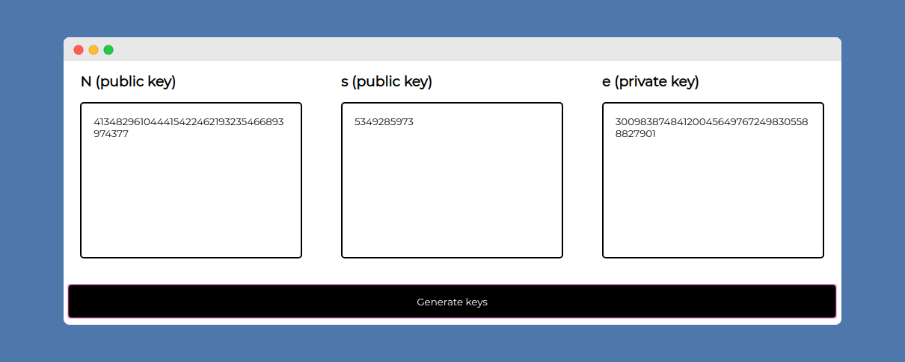
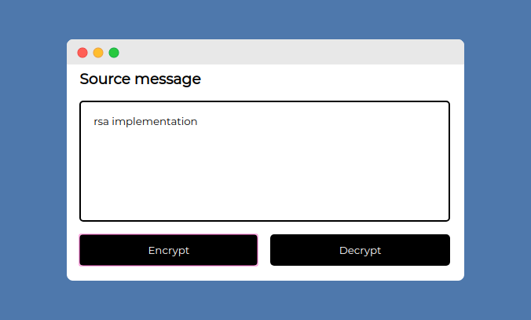
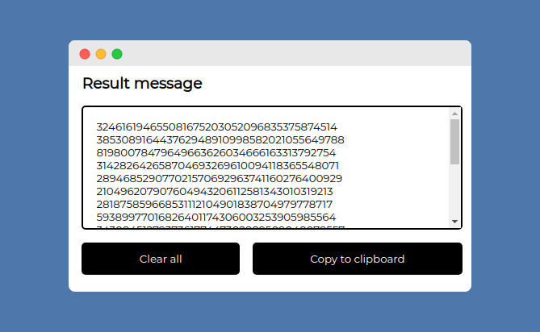
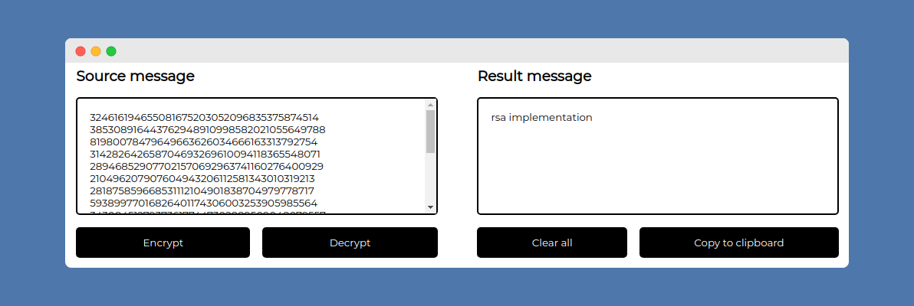
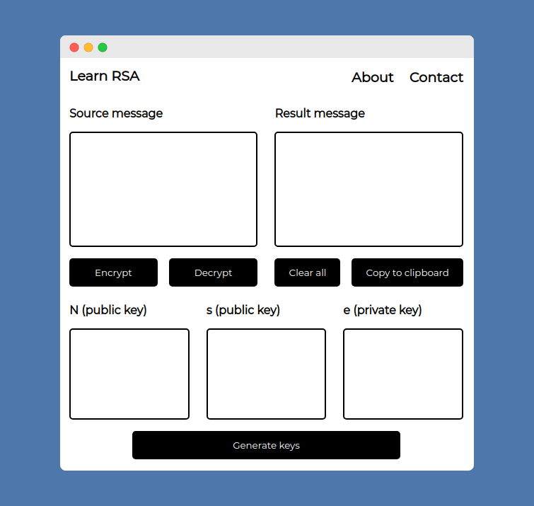
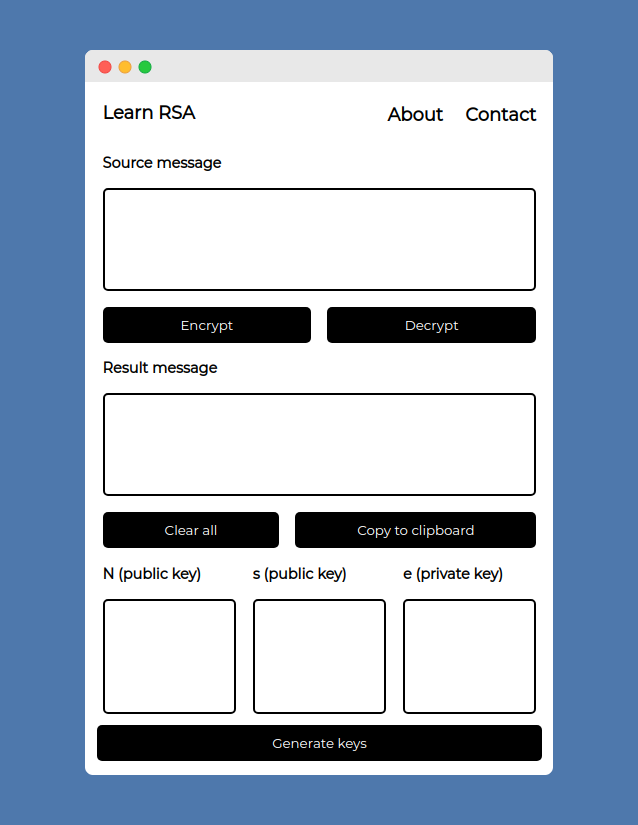

# RSA Implementation JS

### Description

RSA (Rivest–Shamir–Adleman) is one of the first public-key cryptosystems and is widely used for secure data transmission. In such a cryptosystem, the encryption key is public and it is different from the decryption key which is kept secret (private). In RSA, this asymmetry is based on the practical difficulty of the factorization of the product of two large prime numbers, the "factoring problem". The acronym RSA is made of the initial letters of the surnames of Ron Rivest, Adi Shamir, and Leonard Adleman, who first publicly described the algorithm in 1977. Clifford Cocks, an English mathematician working for the British intelligence agency Government Communications Headquarters (GCHQ), had developed an equivalent system in 1973, but this was not declassified until 1997.

A user of RSA creates and then publishes a public key based on two large prime numbers, along with an auxiliary value. The prime numbers must be kept secret. Anyone can use the public key to encrypt a message, but only someone with knowledge of the prime numbers can decode the message. Breaking RSA encryption is known as the RSA problem. Whether it is as difficult as the factoring problem remains an open question. There are currently no published methods to defeat the system if a large enough key is used.

RSA is a relatively slow algorithm, and because of this, it is less commonly used to directly encrypt user data. More often, RSA passes encrypted shared keys for symmetric key cryptography which in turn can perform bulk encryption-decryption operations at much higher speed.

## Technologies

- HTML
- SASS/CSS
- JS
- [bigInt library](https://github.com/TimothyMeadows/bigintjs)

## Usage

### Encryption

To encrypt a message you have to generate keys and then enter a source message and press `encrypt` button.

Then, algorithm encrypts a source message result of which you can see in `Result message` window.

### Decryption

To decrypt a message enter needed keys then enter decrypted message and press `decrypt` button. Result of decryption will appear in `Result message` window.

## Website Adaptiveness

### Tablet

### Mobile

